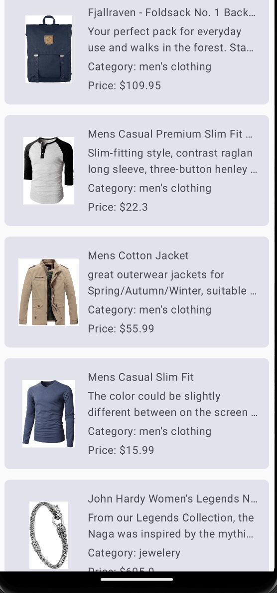
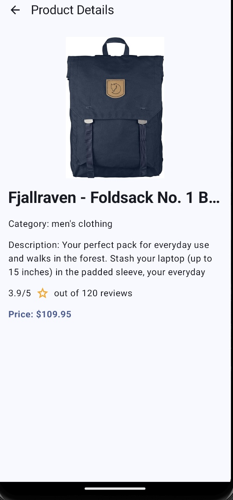

# Shopping Application: Instructions

## Initial Setup

### Configure Gradle
Add necessary dependencies for Jetpack Compose, Retrofit, Coroutines, DataStore, and UnitTesting in the `build.gradle` files.

## App Architecture

### MVVM Architecture
Implement the app using MVVM (Model-View-ViewModel) architecture to ensure a scalable and maintainable codebase.

### Create a Model
Define data classes for the information via Postman.

### Create a Repository
Implement a repository class that will use Retrofit to fetch data from the API.

### Create a ViewModel
Implement a ViewModel that will use the repository to load data and expose it to the UI.

## User Interface

### Create Composable Functions
Create UI screens with Jetpack Compose.

### Implement Navigation
Use Jetpack Navigation to navigate between different screens.

## Fetch Data
Use the location coordinates to fetch data from the API.

## Local Cache with DataStore
Implement local caching using DataStore to store and retrieve data locally for offline access and improved performance.

## Testing

### Write Unit Tests
Use JUnit and Mockito to write unit tests.

